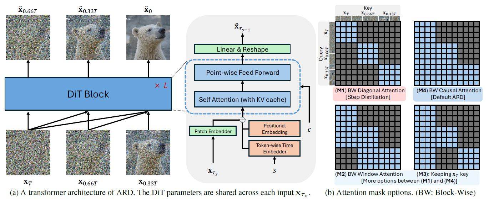
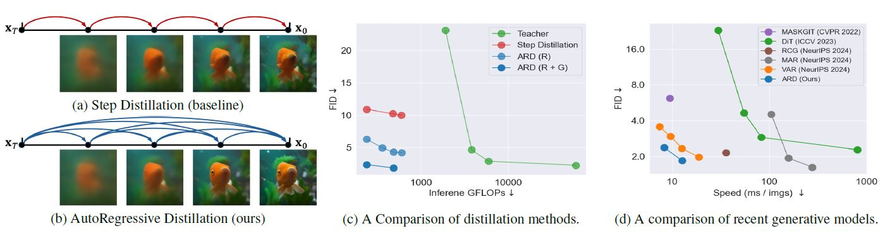
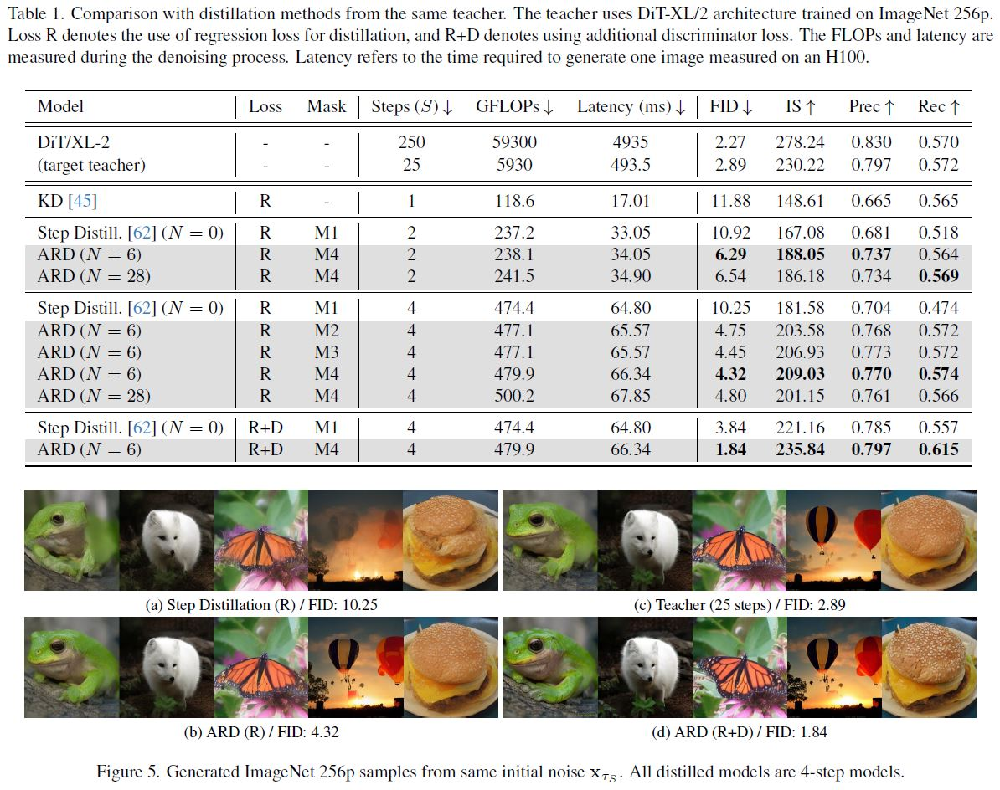

## [CVPR 2025 Oral] Autoregressive Distillation of Diffusion Transformers <br><sub><sub> This repository provides a re-implementation of the original work (ARD), reconstructed from the author's recollection. </sub></sub>
**[Yeongmin Kim](https://sites.google.com/view/yeongmin-space), [Sotiris Anagnostidis](https://sanagnos.pages.dev/), [Yuming Du](https://dulucas.github.io/), [Edgar Schoenfeld](https://edgarschnfld.github.io/), [Jonas Kohler](https://scholar.google.de/citations?user=a1rCLUMAAAAJ&hl=de), [Markos Georgopoulos](https://scholar.google.com/citations?user=id7vw0UAAAAJ&hl=en), [Albert Pumarola](https://www.albertpumarola.com/), [Ali Thabet](https://www.alithabet.com/), [Artsiom Sanakoyeu](https://gdude.de/)**  

**Pytorch implementation and paper are coming within a week!**

## Overview
<i>We propose AutoRegressive Distillation (ARD), a method that leverages the historical trajectory of diffusion ODEs to mitigate exposure bias and improve efficiency in distillation. ARD achieves strong performance on ImageNet and text-to-image synthesis with significantly fewer steps and minimal computational overhead.</i>


## Dependencies
The requirements for this code are the same as [DiT](https://github.com/facebookresearch/DiT).

## Save ODE trajectories
Make sure to save a sufficient number of ODE trajectories using `sample_trajectory.py`, and ensure they match the dataloader used in the subsequent training procedure (see the `--data-path` argument in the training script).

## Training
```
torchrun --nnodes=1 --nproc_per_node=8 train_ARD.py --model DiT-XL/2 --global-batch-size=64 --stack=6
```

## Fine-tuning with GAN loss
```
torchrun --nnodes=1 --nproc_per_node=8 train_ARD_gan.py --model DiT-XL/2 --global-batch-size=48 --stack=6 --ckpt_path={$PATH}/checkpoints/0300000.pt"
```

## Generation
```
torchrun --nnodes=1 --nproc_per_node=1 sample_ARD.py --stack=6 --ckpt_path={$PATH}/checkpoints/0300000.pt"
```

## Performance
We follow the evaluation protocol of [ADM](https://github.com/openai/guided-diffusion/tree/main/evaluations).

| Model | Steps | Latency | FID | Inception Score | Precision | Recall | 
|:-------|:-------:|:-------:|:-------:|:-------:|:-------:|:-------:|
| DiT/XL-2 | 25 | 493.5 | 2.89 | 230.22 | 0.797 | 0.572 |
| Step Distillation (N=0) | 4 | 64.80 | 10.25 | 181.58 | 0.704 | 0.474 |
| ARD (N=6) | 4 | 66.34 | 4.32 | 209.03 | 0.770 | 0.574 |
| + GAN loss finetuning | 4 | 66.34 | 1.84 | 235.84 | 0.797 | 0.615 |



## Citation
If you find the code useful for your research, please consider citing
```bib
@inproceedings{
}
```
